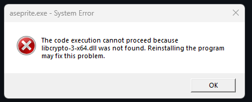

# Aseprite Auto Build

> Auto build Aseprite via GitHub Actions

> [!IMPORTANT]  
> Only supports Windows x64  
> **MUST INSTALL OpenSSL v3 BEFORE RUNNING ASEPRITE**

## Requirements:

### OpenSSL v3 Installation (Required)

Before running Aseprite, you **must** install OpenSSL v3 on your Windows system. Without this, you will encounter the following error:

**Error message:** `The code execution cannot proceed because libcrypto-3-x64.dll was not found`

**Solution:**

1. Download OpenSSL v3 for Windows from: [https://slproweb.com/products/Win32OpenSSL.html](https://slproweb.com/products/Win32OpenSSL.html)
2. Install the **Win64 OpenSSL v3.x.x** (NOT the Light version)
3. During installation, make sure to select the option to copy OpenSSL DLLs to the Windows system directory
4. Restart your computer after installation
5. Run Aseprite

## Usage:

- Click `Use this template` to create a new repository.
- Wait for the build to complete.
- Download the built Aseprite from the releases.
- **Install OpenSSL v3** (see Requirements section above).
- Run Aseprite.

## YouTube:

## Contributors:

## Licenses:

- [Auto Build Aseprite](https://github.com/hardingadonis/aseprite-auto-build) is under the [MIT license](https://github.com/hardingadonis/aseprite-auto-build/blob/main/LICENSE).
